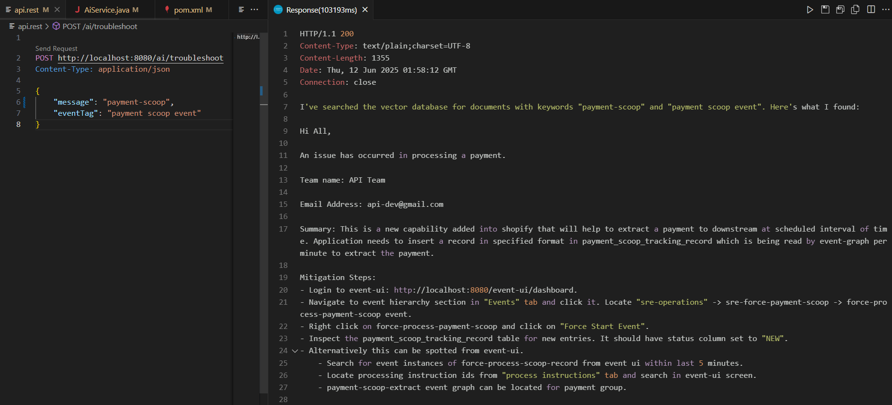

# Smart Exception AI

Smart Exception AI is an intelligent exception handling solution designed to enhance error management in your applications. When an exception occurs, Smart Exception AI captures it, enriches the error details using a Large Language Model (LLM), and routes the enriched information to the relevant team for prompt action.

## Key Features

- **Automated Exception Capture:** Seamlessly intercepts exceptions from your application.
- **LLM-Powered Enrichment:** Utilizes a pre-trained LLM (Llama model via [Ollama](https://ollama.com/)) to provide context, suggestions, and actionable insights for each exception.
- **Team Notification:** Forwards enriched exception reports to the appropriate team, enabling faster resolution.

## How It Works

1. **Exception Occurs:** An exception is thrown in your application.
2. **Exception Captured:** Smart Exception AI intercepts the exception.
3. **LLM Enrichment:** The exception details are sent to the Llama model (via Ollama) for analysis and enrichment.
4. **Notification:** The enriched exception report is sent to the concerned team for action.

## Requirements

- [Ollama](https://ollama.com/) installed and running with the Llama model.
- Proper configuration for team notification (email, messaging, etc.).

## Getting Started

1. Clone this repository.
2. Set up Ollama with the Llama model and run the command
   ```
   ollama run llama3.2
   ```
3. Run docker desktop
4. Run the command
   ```
   docker run -it --rm --name chroma -p 8000:8000 chromadb/chroma
   ```
   Hit http://localhost:8000/api/v2 in web browser to check if it is up and running
5. Integrate Smart Exception AI into your application.
6. Configure notification settings.



## License

See [LICENSE](./LICENSE) for details.

---

Empower your team with actionable exception insights using Smart Exception AI!
